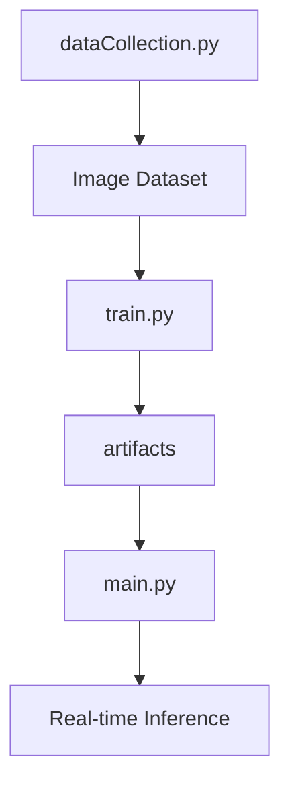

# Sign Language Detection Documentation

This project is a small demo of standard computer vision pipeline in processing images in real-time. It detects when user makes a gesture that simbolises one of the three letters-A,B or C in American Sign Language.


## Pipeline Overview

This flowchart shows the end-to-end workflow, from collecting images to live prediction.



## artifacts/classes.json

This JSON file lists the target classes the model predicts.  
It aligns indices with labels for both training and inference.

```json
[
  "A",
  "B",
  "C"
]
```
- **Path**: `artifacts/classes.json`  
- **Purpose**: Defines class names used by the model .

## artifacts/model_best.pth

This binary file stores the best model state after training.  
It contains the `state_dict` of a PyTorch `efficientnet_b0` model.

- **Path**: `artifacts/model_best.pth`  
- **Format**: PyTorch checkpoint (`.pth`) .  
- **Usage**: Loaded at inference to set model weights.

## artifacts/report.txt

This text file presents classification metrics on the validation set.  
It shows perfect scores for all classes in this example.

```
              precision    recall  f1-score   support
           A     1.0000    1.0000    1.0000        19
           B     1.0000    1.0000    1.0000        28
           C     1.0000    1.0000    1.0000        41

    accuracy                         1.0000        88
   macro avg     1.0000    1.0000    1.0000        88
weighted avg     1.0000    1.0000    1.0000        88
```
- **Path**: `artifacts/report.txt`  
- **Contains**: Precision, recall, F1-score, support per class .  

## dataCollection.py

This script captures and preprocesses hand images for dataset construction.  
It crops and pads each ROI, then saves snapshots on demand.

- **Path**: `dataCollection.py`  
- **Dependencies**: `cv2`, `cvzone`, `numpy`  
- **Key steps**:
  - Initialize webcam and hand detector  
  - Read frames and detect a single hand  
  - Compute ROI with an `offset` margin  
  - Crop ROI and letterbox into a square canvas  
  - Display live crops; save on pressing **s**  
  - Exit on pressing **q**

```python
import cv2
from cvzone.HandTrackingModule import HandDetector
import numpy as np

cap = cv2.VideoCapture(0)
detector = HandDetector(maxHands=1)
offset, imgSize, folder, counter = 20, 300, "data/C", 0

try:
    while True:
        success, img = cap.read()
        if not success:
            continue
        hands, img = detector.findHands(img)
        if hands:
            x, y, w, h = map(int, hands[0]['bbox'])
            imgCrop = img[y-offset:y+h+offset, x-offset:x+w+offset]
            # letterbox into white square
            canvas = np.ones((imgSize, imgSize, 3), np.uint8) * 255
            ch, cw = imgCrop.shape[:2]
            aspect = ch / cw
            # [resize logic…]
            cv2.imshow("ImageWhite", canvas)
        cv2.imshow("Image", img)
        key = cv2.waitKey(1) & 0xFF
        if key == ord("s"):
            counter += 1
            cv2.imwrite(f"{folder}/{counter}.png", canvas)
        if key == ord("q"):
            break
finally:
    cap.release()
    cv2.destroyAllWindows()
```


## train.py

This training script builds, trains, and validates the model.  
It also saves artifacts: the best model weights, class list, and metrics.

- **Path**: `train.py`  
- **Dependencies**: `torch`, `timm`, `torchvision`, `sklearn`, `matplotlib`, `numpy`  
- **Workflow**:
  1. **Set random seed** for reproducibility  
  2. Load images via `ImageFolder`, apply train and eval transforms  
  3. Stratify split into training and validation sets  
  4. Compute class weights to balance loss  
  5. Create DataLoaders with `batch_size`, `num_workers`  
  6. Initialize `efficientnet_b0` with pretrained weights  
  7. Loop over epochs:
     - Train: forward, compute loss, backpropagate with mixed precision  
     - Validate: compute accuracy  
     - If validation accuracy improves, save `model_best.pth`  
  8. Dump `classes.json`, generate `report.txt`  
  9. Produce a confusion matrix plot  

```python
# Simplified train loop
for epoch in range(1, EPOCHS+1):
    model.train()
    for x, y in train_loader:
        x, y = x.to(DEVICE), y.to(DEVICE)
        optimizer.zero_grad()
        with autocast(enabled=USE_AMP):
            logits = model(x)
            loss = criterion(logits, y)
        scaler.scale(loss).backward()
        scaler.step(optimizer); scaler.update()
    # Validation
    model.eval()
    # [compute val_acc…]
    if val_acc > best_acc:
        best_acc = val_acc
        torch.save(model.state_dict(), best_path)
```


## main.py

This script runs real-time inference using the webcam feed.  
It detects hands, crops regions, classifies gestures, and displays results.

- **Path**: `main.py`  
- **Dependencies**: `cv2`, `torch`, `timm`, `cvzone`, `numpy`, `torchvision`  
- **Flow**:
  - Load `classes.json` and model weights  
  - Compose normalization transform  
  - Create a `HandDetector` and open webcam  
  - Define `letterbox_crop` to pad ROIs into squares  
  - In a loop:
    - Detect a hand and crop it  
    - Transform, forward through model, apply softmax  
    - Smooth predictions over last N frames  
    - Display label, confidence, and FPS  
    - Save crop on **s**, quit on **q**

```python
# Key inference steps
img = frame.copy()
hands, img = detector.findHands(frame)
if hands:
    crop = letterbox_crop(frame, hands[0]['bbox'])
    x = tfm(cv2.cvtColor(crop, cv2.COLOR_BGR2RGB)).unsqueeze(0).to(DEVICE)
    with torch.no_grad():
        probs = torch.softmax(model(x), dim=1)[0].cpu().numpy()
    pred_q.append(int(probs.argmax()))
    # [smooth and threshold logic…]
cv2.imshow("Inference", img)
```
